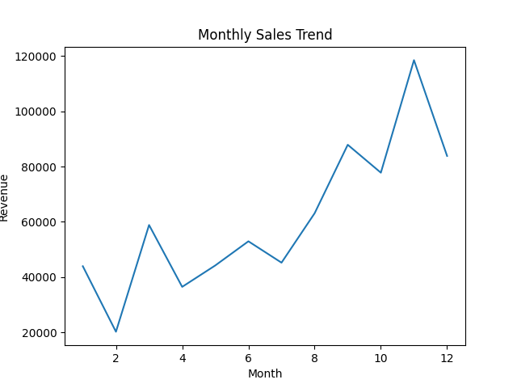
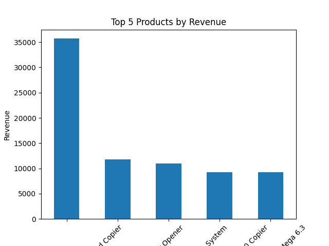

# 📊 E-commerce Sales Analytics Dashboard

## 📌 Overview
This project analyzes e-commerce sales data to generate business insights such as revenue trends, top-performing products, and regional performance.

## 🎯 Objectives
- Analyze sales and profit performance
- Identify top products and regions
- Understand the impact of discounts on profit
- Track monthly sales trends

## 🛠️ Tech Stack
- Python (Pandas, Matplotlib)
- CSV Dataset

## 📊 Key Insights
- Identified top-performing products contributing highest revenue
- Observed sales trends across months
- Found that higher discounts negatively impact profit
- Highlighted top-performing states by revenue

## 📁 Project Structure
ecommerce-analytics/
 ├── data/
 ├── charts/
 ├── analysis.py
 └── README.md

## 📈 Visualizations

### Monthly Sales Trend

### Top Products
